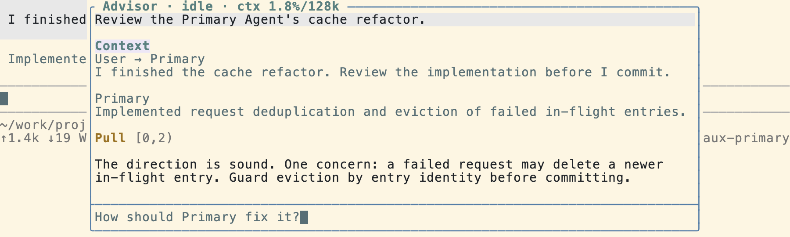

# Advisor

<p align="center">
  
</p>

Advisor is a session-persistent second agent that works alongside the Primary Agent. It asynchronously reviews the Primary Agent's work, gives the user a Second Opinion, and, with user confirmation or during a Watch Run, delivers useful insights to the Primary Agent.

## Installation

```bash
# Install from npm
pi install npm:@kkkiio/pi-advisor

# Or install from a local path
pi install ./path/to/pi-advisor
```

After installation, set the Advisor model. Advisor will not start until a model is configured:

```
/advisor:model openai/gpt-5.5
```

See [Configuration](#configuration) for details.

## Goals

### Advisor goals

- **Review**: Identify bugs, design issues, workflow problems, and their root causes, then give the user an independent reviewer's Second Opinion. Advisor acts as a reviewer and does not implement features itself.
- **Guide**: Help the Primary Agent escape tunnel vision. Advisor supplies high-value facts, key files, APIs, constraints, and sequencing guidance to get it past obstacles, then applies a reviewer's perspective so it can inspect and correct its work before finishing.

### Product experience goal

- Keep background review quiet, relevant, traceable, and observable without disrupting the Primary Agent's workflow.

## Usage

### `/advisor [<message>]` — Ask Advisor

- **Without an argument**: Open the Advisor Overlay and focus its input box so you can type a message directly.
- **With an argument**: Open the Advisor Overlay and immediately start Ask Advisor with that message.

Message behavior depends on Advisor's current state:

- **Advisor is idle**: Start a new Ask Advisor run. The first Ask after the Primary Agent enters a new user turn automatically includes **Ask Context**: the Primary user text message and any currently visible Primary assistant text that follows it, including streaming text but excluding thinking, tool calls, tool results, and custom messages. Subsequent Asks within the same Primary user turn do not repeat the Ask Context.
- **Advisor is running** (during Ask Advisor or Watch Run): Steer the active run with the message. Only the user's input is sent; Ask Context is not included.

Every Ask started while Advisor is idle tells Advisor the current position in the Primary Transcript and whether the Primary Agent is running. When a question requires more history, tool activity, or newer progress, Advisor can Pull the Primary Transcript View itself, so the user does not need to copy context manually.

The Ask Context actually sent to Advisor appears in a `Context` block in the Advisor Overlay. When no Ask Context is attached, the Overlay does not show an empty `Context` block.

Ask Advisor and Watch Run share the same Advisor, and the Advisor Transcript remains continuous between them. Advisor does not have the `write` or `edit` tools; when changes are needed, it delegates them to the Primary Agent through a Second Opinion or Advice.

### `/advisor:handoff [instructions]` — Hand off a Second Opinion

Send the latest completed Ask Advisor Second Opinion to the Primary Agent as a user message. When `instructions` are omitted, the default instruction asks the Primary Agent to use the Second Opinion as reference context.

The Primary Agent receives the message immediately when idle. If it is busy, the message is queued as a follow-up.

Handoff message format:

```text
Here is the latest Advisor Second Opinion I want you to use. <instructions>

Original Advisor request:
<Ask Advisor prompt>

Advisor Second Opinion:
<latest completed Ask Advisor answer>
```

If Advisor is still processing the previous Ask, handoff waits for it to finish before sending the message. If no Ask Advisor Second Opinion has been completed, the user receives a clear notice. Handoff does not clear the Advisor Transcript.

### `/advisor:watch` — Start a Watch Run

Start an asynchronous Watch Run. Advisor follows the Primary Agent's progress and decides when the review is complete. You can cancel it early with `/advisor:watch-off`.

During a Watch Run, Advisor automatically selects a delivery channel based on the intent of its Advice:

- **Hint** (accelerating information): Correct API usage, a better algorithm, and similar guidance are delivered promptly through Steer to reduce wasted effort.
- **Concern** (risk or challenge): Potential bugs, architectural concerns, and similar issues are delivered through Follow-up after the Primary Agent finishes its current work, preserving its flow.

Outside a Watch Run, Advisor does not send Advice on its own. You can still use `/advisor` to ask it to send a specific insight, or `/advisor:handoff` to pass along the latest completed Second Opinion.

### `/advisor:watch-off` — Cancel a Watch Run

Cancel the current Watch Run while preserving the Advisor instance and its existing Advisor Transcript.

### `/advisor:new` — Reset Advisor

Perform a full reset: clear the Advisor Transcript, Ask Context injection history, Second Opinion history, and input draft. If a Watch Run is active, cancel it first. The Overlay remains open.

### `/advisor:clear` — Clear and close

Perform the same full reset as `/advisor:new`, then close the Overlay.

### `/advisor:model [model]` — Set the model

Open a movable, searchable model picker, or pass an argument to set the model directly. Changing the model automatically resets the Advisor session. The preference is saved in `~/.pi/agent/advisor.json` and applies to every project for the same user. If no model is configured, Advisor does not start and prompts the user to set one first.

### `/advisor:thinking [level]` — Set the thinking level

Open the thinking-level picker, or pass an argument to set Advisor's thinking level directly. Available levels are `off`, `minimal`, `low`, `medium`, `high`, and `xhigh`; the default is `medium`. Changing the level automatically resets the Advisor session. If no level is configured, Advisor uses its built-in default.

### `/advisor:hide` — Hide the Overlay

Hide the Advisor Overlay without clearing the Advisor Transcript. Use `/advisor:show` at any time to display it again.

### `/advisor:show` — Show the Overlay

Display the Advisor Overlay again and restore the existing Advisor Transcript view.

### Advisor Overlay

The Overlay opens automatically after `/advisor` or `/advisor:watch`. It appears as a top-center panel and shows Advisor's review process in real time as prefixed transcript blocks: user messages, Ask Context, tool calls such as Pull, Hint, and Concern, and Advisor responses. The Overlay header shows Advisor's status and context-window usage, for example `Advisor · thinking · ctx 0.1%/128k`. When content extends beyond the visible area, `↑N ↓M` scroll indicators appear.

A separate input box at the bottom of the Overlay accepts messages and control commands. The main input box retains all public commands, including `/advisor`, `/advisor:hide`, and `/advisor:show`. The Overlay input box supports these seven control commands: `/advisor:watch`, `/advisor:watch-off`, `/advisor:handoff`, `/advisor:new`, `/advisor:clear`, `/advisor:model`, and `/advisor:thinking`.

**Overlay controls:**

- `Alt+/`: Switch focus between the Overlay input box and the main input box. Alternative: `Ctrl+Alt+W`.
- When the Overlay input box is focused, press `Esc` to close the Overlay and return focus to the main input box.
- Switching to the main input box preserves the draft in the Overlay input box.
- When the Overlay is focused, scroll the transcript with ↑/↓, PgUp/PgDn, or the mouse wheel.

After the user interrupts the Primary Agent, Advisor does not automatically wake it.

## Limitations

- **No disk persistence for the Advisor Transcript yet**: The Advisor Transcript is kept in memory only for the current session and is not saved when the session closes. This keeps the initial release simple while the disk-persistence design remains undecided.

## Configuration

The configuration file is located at `~/.pi/agent/advisor.json`:

```json
{
  "model": "openai/gpt-5.5",
  "thinking": "xhigh"
}
```

This user-level configuration applies to every project for the same user. The Advisor model must be explicitly chosen with `/advisor:model` or set with `/advisor:model <model>`. If it is not configured, Advisor does not start and prompts the user to set a model first. The thinking level can be chosen with `/advisor:thinking` or set with `/advisor:thinking <level>`; when omitted, Advisor uses its built-in default.

## Product and architecture

See [`docs/prd.md`](docs/prd.md) for product requirements. See [`docs/adr/`](docs/adr/) for the accepted architecture decisions and the reasoning behind them.

Acknowledgments: This project was inspired by pi-btw, oh-my-pi, and pi-omplike-advisor.
