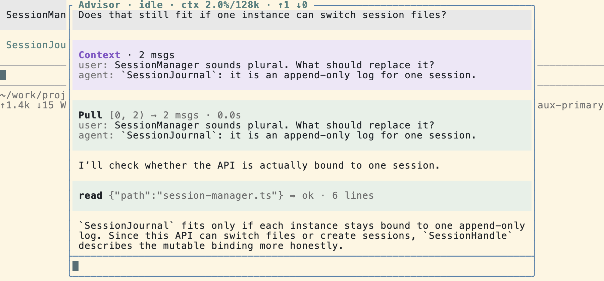

# Advisor

<p align="center">
  
</p>

Advisor combines a `btw`-style Second Opinion with an asynchronous watchdog for Pi. Press `Option+/` on macOS to ask a dedicated reviewer whether the Primary Agent's latest answer is sound, or start a Watch Run and let Advisor follow the task in the background.

For the best pairing, use an expressive model that excels at documentation as the Primary Agent, then give Advisor a rigorous review model such as GPT. The two agents keep separate contexts, so Advisor can challenge the Primary Agent instead of echoing it.

## Installation

```bash
pi install npm:@kkkiio/pi-advisor
```

Set the model that will act as Advisor:

```text
/advisor:model openai-codex/gpt-5.6-sol
```

You can also install a local checkout with `pi install ./path/to/pi-advisor`.

## Usage

### Ask whether the Primary Agent is right

1. Press `Option+/` on macOS (`Alt+/` in Pi's terminal notation).
2. Ask Advisor a question such as: `Was the Primary Agent's last answer correct?`
3. Press `Option+/` again to return to the Primary Agent.

Advisor automatically receives the latest Primary context and can pull more of the transcript when it needs to inspect earlier messages, tool calls, or diffs.

You can also open Advisor and ask in one command:

```text
/advisor Review the Primary Agent's approach and point out anything it missed.
```

### Watch a task

```text
/advisor:watch
```

A Watch Run follows the current Primary task asynchronously. Advisor can send timely guidance while work is in progress and queue concerns for the Primary Agent to handle after its current work. The Overlay can stay closed while the review continues.

Stop the Watch Run at any time:

```text
/advisor:watch-off
```

### Hand off a Second Opinion

After an Ask completes, send its latest Second Opinion to the Primary Agent:

```text
/advisor:handoff
```

## Commands

| Command                           | What it does                                   |
| --------------------------------- | ---------------------------------------------- |
| `/advisor [message]`              | Open Advisor or ask it immediately             |
| `/advisor:watch`                  | Start an asynchronous Watch Run                |
| `/advisor:watch-off`              | Stop the Watch Run and preserve its transcript |
| `/advisor:handoff [instructions]` | Send the latest Second Opinion to Primary      |
| `/advisor:new`                    | Start a fresh Advisor conversation             |
| `/advisor:model [model]`          | Show or set the Advisor model                  |
| `/advisor:thinking [level]`       | Show or set the Advisor thinking level         |

The Advisor Overlay is a top-center work view with its own input and transcript. `Option+/` opens or closes it, `Esc` returns to Primary, and Pi's `app.tools.expand` keybinding (`Ctrl+O` by default) expands Context and Pull blocks. Closing the Overlay preserves the conversation, input draft, and active Watch Run.

Ask Advisor and Watch Run share one session-persistent Advisor. It reviews and guides; it does not receive file-writing tools. During a Watch Run, accelerating information is delivered as a Hint, while risks that should not interrupt active work are delivered as a Concern.

## Configuration

Advisor settings are stored in `~/.pi/agent/advisor.json`:

```json
{
  "model": "openai-codex/gpt-5.6-sol",
  "thinking": "high"
}
```

The Advisor Transcript currently lives in memory for the Pi session and is not persisted after the session closes.

## Acknowledgments

Inspired by pi-btw, oh-my-pi, and pi-omplike-advisor.
